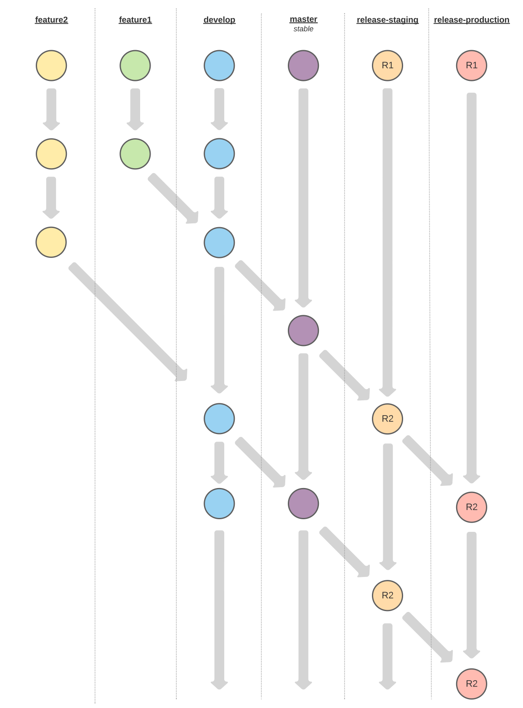

## DAITA Platform User Interface
React-based user interface for the DAITA platform.

## Libraries
- UI: [MUI](https://mui.com)
- State management: [Redux](https://redux.js.org)
- Redux side effect manager: [Redux-Saga](https://redux-saga.js.org)
- S3 client - AWS SDK for JavaScript v3: [@aws-sdk/client-s3](https://docs.aws.amazon.com/AWSJavaScriptSDK/v3/latest/clients/client-s3/index.html)
- HTTP client: [axios](https://www.npmjs.com/package/axios)

## Folder Structure

```bash
public/
  ...
src/
  components/
    [ComponentName]/
      .tsx
    index.ts
  config/
    .ts
  constants/
    .ts
  hooks/
    .ts
  reduxes/
    [reducerName]/
      action.ts
      constants.ts
      reducer.ts
      selector.ts
      type.ts
  routes/
    [PageName]/
      index.tsx
      type.ts
    index.ts
  sagas/
    .ts
  services/
    .ts
  styles/
    .ts
    .css
  utils/
    .ts
```

All files and directories should be **camelCase** to separate words.

**public/**
Contains static files such as `index.html`, JavaScript library files, images, and other assets, etc.

**src/components/**
Contains components that are shared between pages.

**src/config/**
Contains configurations of the app.

**src/contants/**
Contains all constants of the app.

**src/hooks/**
Contains shared React hooks.

**src/reduxes/**
Contains redux's reducer of each app feature. Folder name base on feature's name.

**src/routes/**
Contains pages of the app. Filename base on page's name.

**src/sagas/**
Contains saga files of corresponding redux reducer.

**src/services/**
Contains API endpoints.

**src/styles/**
Contains custom styles for general sections.

**src/utils/**
Contains functions shared between the app.

## Installation

It is recommended to install [Yarn](https://classic.yarnpkg.com) through the `npm` package manager, which comes bundled with [Node.js](https://nodejs.org) when you install it on your system. It is recommended to use a Node.js version `>= 16.0.0`.

Once you have `npm` installed, you can run the following both to install and upgrade Yarn:

```bash
npm install --global yarn
```

After having installed Yarn, simply run:

```bash
yarn install
```

## Serving the Application

> You need an `.env` file for successful running. Contact the administrator for more information.

In the project directory, you can run:

```bash
yarn start
```

Runs the app in the development mode. Open [http://localhost:3000](http://localhost:3000) to view it in the browser.

The page will reload if you make edits. You will also see any lint errors in the console.

## Building the Application

In the project directory, you can run:

```bash
yarn build
```

Builds the app for production to the `build` folder. It correctly bundles React in production mode and optimises the build for the best performance.

The build is minified and the filenames include the hashes. Your app is ready to be deployed!

---

## A Note on Releases

The repository should be setup in the future in such a way that changes to the branch `release-staging` and `release-production` will trigger a rebuild of the Staging and the Production application, respectively.

The merge flow for changes should be as follows:

```bash
<feature_branch> -> <develop> -> <main> -> <release-staging> -> <release-production>
```


